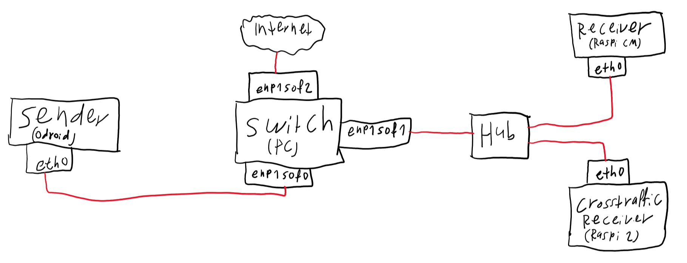

# Network Setup

The devices must be wired like this:

Please note the names of the interfaces.

## Setting up the configuration
Please make sure that Netplan (package name `netplan.io`)is installed on all involved devices. This is required because the network configuration is realized through Netplan yaml files.

Then run
- `setup-switch.sh` on the switch PC
- `setup-sender.sh` on the sender device (for the sensor of the pendulum)
- `setup-receiver.sh` on the receiver device (for the receiver of the pendulum)
- `setup-crosstraffic-receiver.sh` on the crosstraffic receiving device.

## IP Addresses
The devices will get the following static IP addresses:

- Switch:
    - enp1s0f0: 10.0.1.1
    - enp1s0f1: 10.0.2.1
    - enp1s0f2: *determined by external DHCP server*
- Sender: eth0: 10.0.1.2
- Receiver: eth0: 10.0.2.2
- Crosstraffic Receiver: eth0: 10.0.2.3
